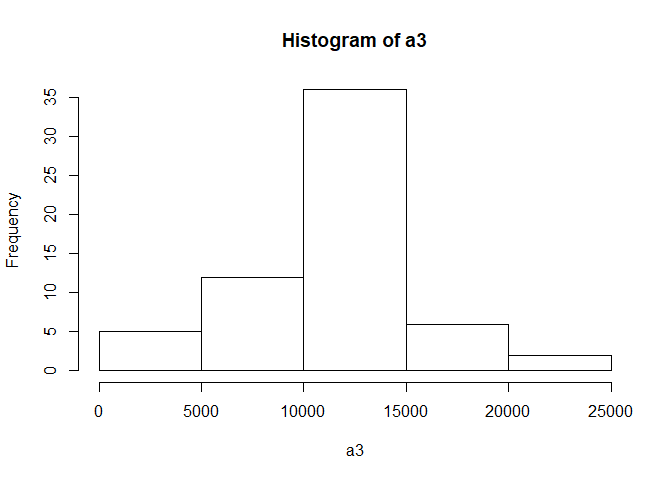

## Loading and preprocessing the data
1. Code for loading the required libraries and the data.  

```r
## Loading libraries
library(readr)
library(plyr)
```

```
## Warning: package 'plyr' was built under R version 3.6.3
```

```r
library(dplyr)
```

```
## Warning: package 'dplyr' was built under R version 3.6.3
```

```
## 
## Attaching package: 'dplyr'
```

```
## The following objects are masked from 'package:plyr':
## 
##     arrange, count, desc, failwith, id, mutate, rename, summarise,
##     summarize
```

```
## The following objects are masked from 'package:stats':
## 
##     filter, lag
```

```
## The following objects are masked from 'package:base':
## 
##     intersect, setdiff, setequal, union
```

```r
library(Hmisc)
```

```
## Warning: package 'Hmisc' was built under R version 3.6.3
```

```
## Loading required package: lattice
```

```
## Warning: package 'lattice' was built under R version 3.6.3
```

```
## Loading required package: survival
```

```
## Warning: package 'survival' was built under R version 3.6.3
```

```
## Loading required package: Formula
```

```
## Loading required package: ggplot2
```

```
## Warning: package 'ggplot2' was built under R version 3.6.3
```

```
## 
## Attaching package: 'Hmisc'
```

```
## The following objects are masked from 'package:dplyr':
## 
##     src, summarize
```

```
## The following objects are masked from 'package:plyr':
## 
##     is.discrete, summarize
```

```
## The following objects are masked from 'package:base':
## 
##     format.pval, units
```

```r
## Reading the data
activity <- read_csv("activity.zip")
```

```
## Parsed with column specification:
## cols(
##   steps = col_double(),
##   date = col_date(format = ""),
##   interval = col_double()
## )
```

2. Processing the data(including all the procesing for further analyses)  

```r
a1 <- tapply(activity$steps, activity$date, sum, na.rm = TRUE)
a2 <- tapply(activity$steps, activity$interval, mean, na.rm = TRUE)
```

## What is mean total number of steps taken per day?
1. Following is the histogram for the total number of steps taken everyday  

```r
hist(a1)
```

<!-- -->
The histogram shows the frequency of the total number of steps taken everyday  
2. Followng is the mean and median of the total number of steps taken everyday  

```r
mean(a1)
```

```
## [1] 9354.23
```

```r
median(a1)
```

```
## [1] 10395
```

## What is the average daily activity pattern?
1. Following is the code for the time series plot of the total number of steps taken everyday  

```r
plot(a2, type = "l", lwd = 2)
```

<!-- -->

2.The 5-minute interval which has highest avergave on all days is  

```r
which.max(a2)
```

```
## 835 
## 104
```

## Imputing missing values
1.The total number of missing values in the dataset are:  

```r
sum(is.na(activity$steps))
```

```
## [1] 2304
```

2. The missing values are replaced with the mean of the corresponding 5-minute interval  

```r
activity2 <- activity %>%
        group_by(interval) %>%
        mutate_each(funs(replace(., which(is.na(.)), mean(., na.rm=TRUE))), 
                                       +                   starts_with('steps'))
```

```
## Warning: `funs()` is deprecated as of dplyr 0.8.0.
## Please use a list of either functions or lambdas: 
## 
##   # Simple named list: 
##   list(mean = mean, median = median)
## 
##   # Auto named with `tibble::lst()`: 
##   tibble::lst(mean, median)
## 
##   # Using lambdas
##   list(~ mean(., trim = .2), ~ median(., na.rm = TRUE))
## This warning is displayed once every 8 hours.
## Call `lifecycle::last_warnings()` to see where this warning was generated.
```

```
## Warning: `mutate_each_()` is deprecated as of dplyr 0.7.0.
## Please use `across()` instead.
## This warning is displayed once every 8 hours.
## Call `lifecycle::last_warnings()` to see where this warning was generated.
```

3. A new dataset called activity2 is created after imputing the missing values  

4. Histogram of the total number of steps taken everyday after imputing the values is as follows:  

```r
a3 <- tapply(activity$steps, activity$date, sum, na.rm = TRUE)
hist(a3)
```

<!-- -->
 The mean and median of the total steps taken everyday in the new dataset is as follows:  

```r
mean(a3)
```

```
## [1] 9354.23
```

```r
median(a3)
```

```
## [1] 10395
```

## Are there differences in activity patterns between weekdays and weekends?
1. A new factor variable is created with two levels : Weekdays & weekends  

```r
weekday1 <- c("Monday", "Tuesday", "Wednesday", "Thursday", "Friday")
activity2 <- mutate(activity2, holiday = factor((weekdays(date) %in% weekday1), 
                                                levels=c(FALSE, TRUE), labels=c('weekend', 'weekday') ))
```

2. Plotting the average of the steps taken in each 5-minute interval according to the factor variable holiday:  

```r
act2 <- group_by(activity2, holiday, interval) %>% summarise(steps = mean(steps))
```

```
## `summarise()` regrouping output by 'holiday' (override with `.groups` argument)
```

```r
ggplot(na.omit(act2), aes(x = interval, y = steps)) + geom_line() + facet_wrap(.~holiday, nrow = 2)
```

<!-- -->
